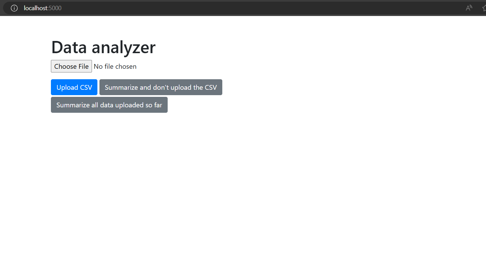
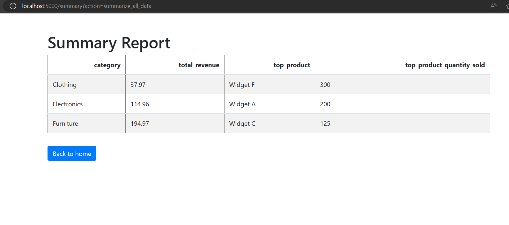

## Prerequisites
- python 3
```shell
pip install sqlalchemy pandas flask flask_sqlalchemy flask_bcrypt pyjwt
```

## Quickstart
```shell
python python_assessment_script.py
```
## Snaphshots



## Endpoints
- /signup
```shell
curl  -X POST \
  'http://localhost:5000/signup' \
  --header 'Accept: */*' \
  --header 'User-Agent: Thunder Client (https://www.thunderclient.com)' \
  --header 'Content-Type: application/json' \
  --data-raw '{
  "username": "test",
  "password": "test"
}'
```

- /login
```shell
curl  -X POST \
  'http://localhost:5000/login' \
  --header 'Accept: */*' \
  --header 'User-Agent: Thunder Client (https://www.thunderclient.com)' \
  --header 'Content-Type: application/json' \
  --data-raw '{
  "username": "test",
  "password": "test"
}'
```
